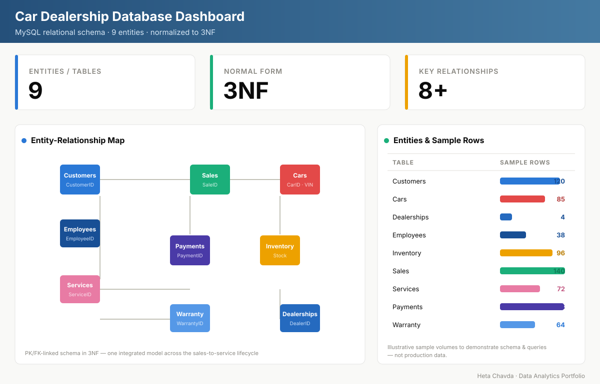

<div align="center">



# 🗄️ Car Dealership Database System
### Relational Database Design & Implementation — MySQL, Normalized to 3NF


</div>

---

## 📌 Project at a Glance

| | |
|---|---|
| **🎯 Goal** | Design & implement a relational database to run car-dealership operations |
| **🧠 Approach** | ERD → 3NF normalization → SQL schema → analytical queries |
| **📊 Scope** | 9 interconnected entities covering the full sales-to-service lifecycle |
| **⚙️ Delivery** | MySQL schema, ER diagram, sample queries + report & presentation |

---

## 🧩 Business Problem

A multi-location car dealership tracks customers, vehicles, staff, inventory, sales, service, payments, and warranties — often in disconnected spreadsheets. That causes duplicated data, broken links between a sale and its payment, and no reliable way to report performance.

> 🚗 **Core question:** *How do we model dealership operations as one integrated, normalized database so that sales, service, payments, and warranties stay consistent and are easy to query for decisions?*

A well-designed schema removes redundancy, protects data integrity, and unlocks reporting like total sales by dealership or service cost by customer.

---

## 🗂️ Schema & Entities

Nine tables in **Third Normal Form (3NF)**, linked by primary and foreign keys.

| Entity | Key Columns | Relationships |
|---|---|---|
| 👤 **Customers** | CustomerID (PK), FirstName, LastName, Email, Phone, AddressID | → Sales, Services, Warranty |
| 🚗 **Cars** | CarID (PK), Make, Model, Year, Price, VIN | → Inventory, Sales, Services, Warranty |
| 🏢 **Dealerships** | DealershipID (PK), Name, AddressID, Phone | → Employees, Inventory |
| 🧑‍💼 **Employees** | EmployeeID (PK), Name, Position, Department, DealershipID (FK) | ← Dealerships |
| 📦 **Inventory** | InventoryID (PK), CarID (FK), DealershipID (FK), StockQuantity | ← Cars, Dealerships |
| 💰 **Sales** | SaleID (PK), CustomerID, EmployeeID, CarID (FK), SaleDate, SalePrice | → Payments |
| 🔧 **Services** | ServiceID (PK), CarID, CustomerID (FK), ServiceDate, Description, Cost | ← Cars, Customers |
| 💳 **Payments** | PaymentID (PK), SaleID (FK), PaymentMethod, Date, Amount | ← Sales |
| 🛡️ **Warranty** | WarrantyID (PK), CarID, CustomerID (FK), StartDate, EndDate, Coverage | ← Cars, Customers |

---

## 🔬 Methodology

```
DESIGN                     NORMALIZE                 IMPLEMENT & QUERY
────────────────           ────────────────          ────────────────
1. Identify entities       1. Apply 1NF → 2NF → 3NF   1. Write DDL: CREATE
   & business domains       2. Remove redundancy         TABLE + constraints
2. Draw ERD with           3. Enforce integrity via   2. DML: INSERT sample
   relationships              PK / FK constraints         records
3. Define attributes       4. Validate dependencies   3. DQL: analytical
   & candidate keys           are on the key only          SELECT / JOIN / GROUP
```

---

## 📊 Database Schema Dashboard

<div align="center">



*Entity-relationship map of the 9-table dealership schema and the analytical queries it powers, built from the project's ERD and MySQL implementation. Row counts are illustrative sample volumes.*

</div>

---

## 📈 Key Insights

- **One integrated model** links a sale to its customer, car, employee, payment, and warranty with no duplicated data
- **3NF normalization** removes redundancy so every fact is stored once and updates stay consistent
- **Foreign-key constraints** guarantee referential integrity — no orphan sales, payments, or services
- **Multi-dealership support** lets the same schema scale to additional locations without redesign
- **Analytical queries** answer real questions: total sales by dealership, service cost by customer, inventory by location

---

## 💼 Business Impact

| Area | Value |
|---|---|
| 🧹 **Data quality** | Redundancy removed and integrity enforced through 3NF + FK constraints |
| 📊 **Reporting** | Aggregate sales, service, and payment analysis via SQL JOINs and GROUP BY |
| 🏢 **Scalability** | Add dealerships, staff, and inventory without changing the core design |
| 🔗 **Traceability** | Every payment ties back to a sale; every warranty to a car and customer |
| 🔮 **Next step** | Clean relational base ready for ML on sales forecasting & customer trends |

---

## 🛠️ Technologies Used

| Category | Tools |
|---|---|
| **Database** | MySQL (relational) |
| **Design** | Entity-Relationship Diagram, 3NF normalization |
| **SQL** | DDL (schema), DML (data), DQL (queries) |
| **Deliverables** | ERD image, normalized schema diagram, query outputs |

---

## 📁 Repository Contents

```
Car Dealership Database System/
├── 📁 assets/
│   ├── 🎨 banner.svg             # Repository banner
│   ├── 📊 dashboard.svg          # Database schema dashboard
│   ├── 🖼️ ERD.png                # Entity-Relationship Diagram
│   ├── 🖼️ schema_3nf.jpg         # Normalized (3NF) schema
│   ├── 🖼️ sql_query.png          # Example analytical query
│   └── 🖼️ sql_output.png         # Query result set
├── 📁 docs/
│   ├── 📄 Final Report.docx      # Design rationale & documentation
│   └── 📄 Project Presentation.pptx  # Summary slides
├── 📁 outputs/                   # Additional query outputs
└── 📝 README.md                  # Project overview
```

---

<div align="center">

**Heta Chavda** — Data Analytics | Database Design | SQL

[](https://github.com/hetachavda)
[](https://linkedin.com/in/hetachavda)

⭐ *Found this useful? Give it a star!*

</div>
