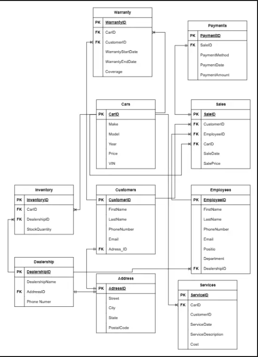
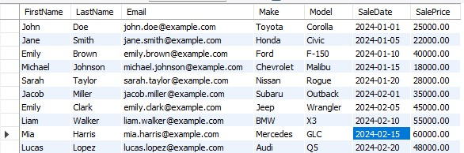
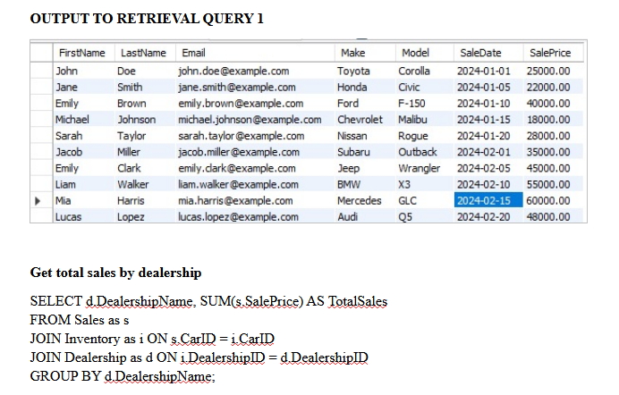
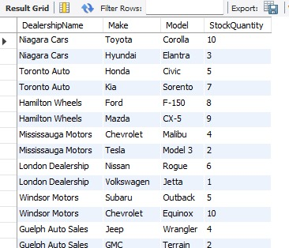

# 🚗 Car Dealership Database System  

A comprehensive **SQL-based relational database** designed and implemented to manage the operations of a car dealership. This project demonstrates **database design, normalization, DDL/DML/DQL implementation, and advanced data retrieval queries**.  

---

## 📌 Project Overview  
The Car Dealership Database System provides an efficient way to store and manage data related to:  
- Customers  
- Cars  
- Employees  
- Dealerships  
- Inventory  
- Sales  
- Services  
- Payments  
- Warranties  

The system ensures **scalability, reliability, and data integrity** while supporting critical business processes such as inventory management, sales tracking, service scheduling, and customer relationship management.  

---

## 🎯 Objectives  
- Build a **robust and normalized** relational database.  
- Simplify **inventory, sales, and service management**.  
- Ensure **data accuracy** and eliminate redundancy.  
- Support **complex data queries** for reporting and decision-making.  
- Enable **future integration with Machine Learning tasks** (sales forecasting, customer trends, etc.).  

---

## 🏗️ Database Design  

### Entity-Relationship Diagram (ERD)  
Key entities and relationships include:  
- **Customers** ↔ Sales, Services, Warranty  
- **Cars** ↔ Inventory, Sales, Services, Warranty  
- **Employees** ↔ Sales  
- **Dealerships** ↔ Employees, Inventory  
- **Payments** ↔ Sales  

### Schema Highlights  
- **Customers (CustomerID, FirstName, LastName, Email, PhoneNumber, AddressID)**  
- **Cars (CarID, Make, Model, Year, Price, VIN)**  
- **Dealerships (DealershipID, Name, AddressID, Phone)**  
- **Employees (EmployeeID, FirstName, LastName, Position, Department, DealershipID)**  
- **Inventory (InventoryID, CarID, DealershipID, StockQuantity)**  
- **Sales (SaleID, CustomerID, EmployeeID, CarID, SaleDate, SalePrice)**  
- **Services (ServiceID, CarID, CustomerID, ServiceDate, Description, Cost)**  
- **Payments (PaymentID, SaleID, PaymentMethod, Date, Amount)**  
- **Warranty (WarrantyID, CarID, CustomerID, StartDate, EndDate, CoverageDetails)**  

---
## 🧩 Entity Relationship Diagram (ERD)


*Figure: Entity Relationship Diagram representing relationships between customers, cars, sales, and services.*

---

## 🏗️ Database Schema (3NF)


*Figure: Normalized database schema (Third Normal Form) ensuring data integrity and eliminating redundancy.*

---

## 📊 SQL Query Example


*Figure: Sample SQL aggregation query used for business insights.*

---

## 📈 SQL Query Output (Sales Analysis)


*Figure: Output of SQL query showing dealership sales performance.*
---
## ⚙️ Implementation  

- **DDL (Data Definition Language):**  
  Created normalized tables with appropriate constraints and foreign keys.  

- **DML (Data Manipulation Language):**  
  Inserted sample data for Customers, Cars, Dealerships, Employees, Sales, Services, Payments, and Warranties.  

- **DQL (Data Query Language):**  
  Advanced queries for retrieving insights such as:  
  - All customers and their car purchases  
  - Total sales by dealership  
  - Customers who purchased a specific model (e.g., Toyota Corolla)  
  - Inventory details across dealerships  
  - Aggregate service costs by customer  

---

## 📊 Sample Query  

```sql
-- Retrieve total sales by dealership
SELECT d.DealershipName, SUM(s.SalePrice) AS TotalSales
FROM Sales s
JOIN Inventory i ON s.CarID = i.CarID
JOIN Dealership d ON i.DealershipID = d.DealershipID
GROUP BY d.DealershipName;
````

---

## ✅ Results & Benefits

* **Integrated System:** Links core dealership operations seamlessly.
* **Data-Driven Insights:** Enables managers to track sales performance, customer services, and inventory.
* **Scalability:** Supports adding more dealerships and expanding features.
* **Operational Efficiency:** Streamlines sales, services, payments, and warranty tracking.
* **ML-Ready Data:** Facilitates predictive analytics for business growth.

---

## 👨‍💻 Contributors

* **Heta Chavda** (NF1014555)
* **Kelechi C. Uchendu** (NF1002048)
* **Renato Hiroyuki Oshiro** (NF1011996)

Course: **CPSC-500-1 SQL Databases**
Professor: **Abbas Hamze**

---

## 📂 Tech Stack

* **MySQL** (Database)
* **SQL DDL/DML/DQL**
* **Normalization Techniques**

---

## 📌 Conclusion

This project showcases the full lifecycle of database development from **design** to **implementation** and **analysis**. The Car Dealership Database System provides a **scalable, reliable, and efficient** solution for real-world dealership management.

---
